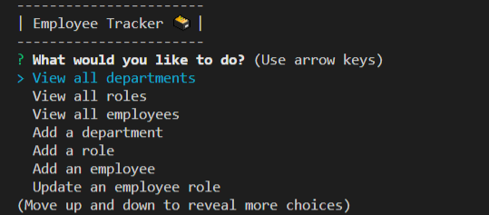

# Employee-Tracker

## Description

My motivation in completing this project was to apply what I learned this week about Mysql. I built this project because I wanted to test my skills and see if I could be effective in creating an Employee Tracker. The Employee Tracker solves the problem of being able to view and manage the departments, roles, and employees in a company. Through this project I learned more about how to work databases, tables, node and inquirer combined. I faced a couple small challenges with this project, but I mostly struggled with getting the syntax correct, getting my queries to show what I needed, and switching string input to take an integer response.  

## Application Appearance

## Video Walk-through Link
